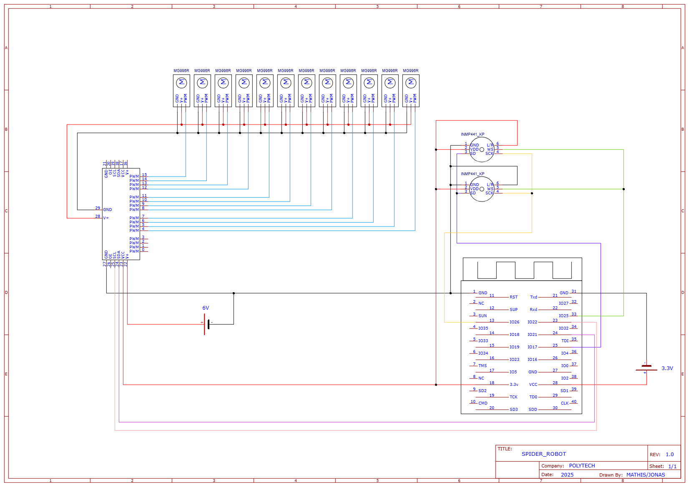

# Sound-Tracking Bot

[](https://github.com/matagno/sound-tracking-bot/blob/master/README.md)
[](https://github.com/matagno/sound-tracking-bot/blob/master/README.fr.md)

## 📋 Description

**Sound-Tracking Bot** is an autonomous quadruped robot controlled by **acoustic detection** and capable of:
- 🎵 Localizing a sound source via stereo cross-correlation
- 🤖 Moving autonomously or via teleoperation
- 🌐 Communicating via WebSocket for remote control
- 🎚️ Filtering and processing audio signals in real-time

The system runs on an **ESP32** with stereo I2S audio acquisition and control of 12 servo motors via PCA9685.

---

## 🏗️ Architecture

### Project Structure
```
src/
├── main.cpp                    # Entry point, FreeRTOS tasks
├── bot/                        # Robot control
│   ├── bot_ctrl.cpp/hpp        # Inverse kinematics, locomotion
│   └── utils/
│       ├── ik_calcul.cpp/hpp   # IK calculation for legs
│       └── pca9685.cpp/hpp     # PWM driver for servos
├── sound/                      # Audio processing
│   ├── i2s_sound_acquisition.cpp/hpp  # Stereo I2S acquisition
│   ├── st_sample_data.hpp      # Audio data structure
│   └── utils/
│       └── biquad_filter.cpp/hpp      # Bandpass filter
└── ws_com/                     # WebSocket communication
    ├── web_socket_server.cpp/hpp      # WebSocket server
    └── st_cmd_data.hpp         # Received commands
```

---

## 🎯 Key Features

### 1️⃣ Acoustic Detection
```cpp
// Sound source localization via L/R signal cross-correlation
// Returns the angle of the sound source in degrees
int calculate_angle(const std::vector<float>& sigL, const std::vector<float>& sigR)
```
- **Sampling frequency**: 44.1 kHz
- **Frequency band**: 1-1.2 kHz (bandpass filtering)
- **Microphone distance**: 10 cm
- **Resolution**: Windows of 441 samples

### 2️⃣ Inverse Kinematics
```cpp
std::array<double,3> ik_leg(const std::array<double,3>& target, ...)
// Returns [hip_angle, knee_angle, foot_angle]
```
- IK calculation for **4 legs** (2 front, 2 rear)
- Lengths: coxa=60mm, tibia=76.84mm, tarsus=128.05mm

### 3️⃣ Locomotion
- **Autonomous mode**: Sound tracking with tripod gait
- **Teleoperated mode**: WebSocket control
- **Gait parameters**: Step length=130mm, height=70mm, period=2s

### 4️⃣ WebSocket Control
```
ws://192.168.4.1/ws

Commands:
- "ping" → "pong"
- "get_angle" → angle in degrees
- "set_auto-true/false"
- "set_manual-true/false"
- "set_teleop-true/false"
- "set_qTarget-<float>-<index>"
- "set_qActive-<true/false>-<index>"
```

---

## 🔧 Hardware Configuration

### ESP32 D1 Mini
| Component | GPIO | Notes |
|-----------|------|-------|
| **I2S Audio** | | Stereo acquisition |
| BCK (Bit Clock) | 26 | |
| WS (Word Select) | 25 | |
| DATA_IN | 17 | L/R 32-bit data |
| **PCA9685** | I2C | PWM servo driver @ 50 Hz |
| SDA | 21 | |
| SCL | 22 | |
| **WiFi** | SoftAP | SSID: `ESP_Spider` |

### Servo Motors
- **Count**: 12 (3 per leg × 4 legs)
- **Range**: 0°-180°
- **Frequency**: 50 Hz

### Electrical Schematic


---

## 🚀 Quick Start

### 1. Configuration
```bash
# Copy configuration
cp sdkconfig.esp32_d1_mini sdkconfig
```

### 2. Build and Upload
```bash
idf.py build
idf.py flash monitor
```

### 3. WebSocket Connection
```bash
# Via wscat
wscat -c ws://192.168.4.1/ws
```

---

## 📊 Audio Signal Processing

### Audio Pipeline
```
I2S Input (44.1 kHz) 
    ↓
Biquad Filter (1-1.2 kHz)
    ↓
Sliding window (441 samples)
    ↓
L-R cross-correlation
    ↓
Angle calculation (arcsin + degree conversion)
```

### Bandpass Filter
```cpp
void setup_bandpass(float f1, float f2, float fs)
// Center frequency: sqrt(f1*f2)
// Quality factor: sqrt(f2/f1)
```

---

## 🤝 Operating Modes

### Autonomous Mode
- Active sound listening
- If valid angle: turns toward sound source
- If angle < 20°: moves forward
- Otherwise: continues turning

### Manual Mode
- Direct control of target angles
- Individual servo enable/disable

### Teleoperated Mode
- **run** (move forward) and **turn** commands
- Customizable turning angle

---

## 📈 FreeRTOS Tasks

| Task | Priority | Period | Function |
|------|----------|--------|----------|
| `sound_task` | 5 | Continuous | I2S audio acquisition |
| `cycle_task` | 4 | 100 ms | Motor control, processing |

---

## 📚 Références

- [ESP-IDF Documentation](https://docs.espressif.com/projects/esp-idf/)
- [FreeRTOS](https://www.freertos.org/)

---

